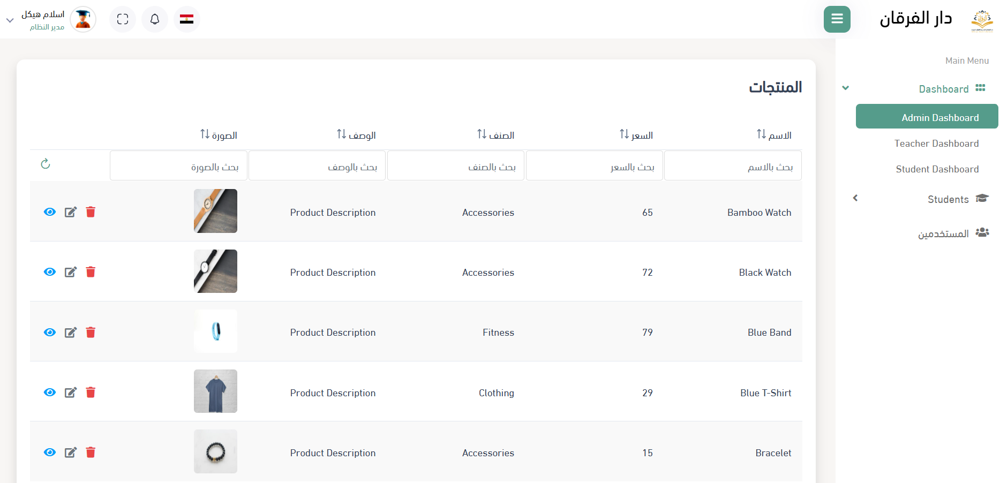

# Angular Admin Template

A modern, feature-rich Angular 20 admin dashboard template built with PrimeNG components and Bootstrap 5. This template provides a solid foundation for building enterprise-level admin applications with a clean, responsive design and comprehensive UI components.



## 🚀 Features

- **Modern Angular 20** - Built with the latest Angular framework
- **PrimeNG Integration** - Rich UI components library
- **Bootstrap 5** - Responsive CSS framework
- **RTL Support** - Arabic language support with RTL layout
- **Modular Architecture** - Well-organized component structure
- **Reusable Components** - Grid, Cards, Buttons, Dropdowns, and more
- **Loading States** - Integrated loading service with ngx-ui-loader
- **Responsive Design** - Mobile-first approach
- **FontAwesome Icons** - Comprehensive icon library

## 📁 Project Structure

```
src/
├── app/
│   ├── layout/                 # Layout components
│   │   ├── header/            # Top navigation bar
│   │   ├── sidenav/           # Side navigation menu
│   │   ├── footer/            # Footer component
│   │   ├── notification/      # Notification system
│   │   └── select-language/   # Language selector
│   ├── modules/
│   │   ├── dashboard/         # Dashboard module
│   │   ├── ui-controls/       # UI Components showcase
│   │   ├── administration/    # Admin features
│   │   └── shared/           # Shared components & services
│   │       ├── components/   # Reusable UI components
│   │       ├── buttons/      # Button components
│   │       ├── services/     # Shared services
│   │       ├── models/       # Data models
│   │       ├── enums/        # TypeScript enums
│   │       └── props/        # Component props interfaces
│   └── assets/
│       ├── css/              # Global styles
│       ├── fonts/            # Custom fonts
│       ├── icons/            # Icon assets
│       └── images/           # Image assets
```

## 🛠️ Prerequisites

Before running this project, make sure you have the following installed:

- **Node.js** (version 18 or higher)
- **npm** or **yarn** package manager
- **Angular CLI** (version 20.1.1 or higher)

## 🚀 Getting Started

### 1. Clone the Repository

```bash
git clone <repository-url>
cd angular-template
```

### 2. Install Dependencies

```bash
npm install
```

### 3. Start Development Server

```bash
ng serve
```

Navigate to `http://localhost:4200/`. The application will automatically reload if you change any of the source files.

## 📦 Available Scripts

- `npm start` - Start the development server
- `npm run build` - Build the project for production
- `npm run watch` - Build the project in watch mode
- `npm test` - Run unit tests
- `ng generate component component-name` - Generate a new component

## 🎨 UI Components

The template includes a comprehensive set of reusable components:

### Core Components
- **Grid** - Advanced data table with sorting, filtering, and pagination
- **Card Container** - Flexible card layout component
- **Progress Bar** - Customizable progress indicators
- **Switch** - Toggle switch component
- **Dropdown** - Enhanced dropdown with search and filtering

### Button Components
- **Add Button** - Primary action button
- **Save Button** - Form submission button
- **Cancel Button** - Secondary action button

### Layout Components
- **Header** - Top navigation with notifications and language selector
- **Sidebar** - Collapsible navigation menu
- **Footer** - Application footer
- **Delete Confirmation** - Modal confirmation dialog

## 🔧 Configuration

### Angular Configuration
The project uses Angular 20 with the following key configurations:
- Standalone components architecture
- Modern routing system
- SCSS for styling
- TypeScript strict mode

### Dependencies
- **@angular/common**: ^20.1.0
- **@angular/core**: ^20.1.0
- **@angular/forms**: ^20.1.0
- **@angular/router**: ^20.1.0
- **primeng**: ^20.0.0
- **bootstrap**: ^5.1.3
- **ngx-ui-loader**: ^13.0.0

## 🎯 Key Features

### Grid System
The template includes a powerful grid component with:
- Server-side pagination
- Column sorting
- Advanced filtering
- Row actions (view, edit, delete)
- Custom column types (text, image, etc.)
- Responsive design

### Layout System
- Responsive sidebar navigation
- Header with notifications
- Footer component
- Language selection support
- RTL layout support for Arabic

### Services
- **ProductService** - Sample data service
- **LoaderService** - Global loading state management

## 🧪 Testing

Run the unit tests:

```bash
ng test
```

## 📦 Building for Production

To build the project for production:

```bash
ng build
```

The build artifacts will be stored in the `dist/` directory.

## 🌐 Browser Support

This template supports all modern browsers:
- Chrome (latest)
- Firefox (latest)
- Safari (latest)
- Edge (latest)

## 📝 Code Scaffolding

Angular CLI provides powerful code generation tools:

```bash
# Generate a new component
ng generate component component-name

# Generate a new service
ng generate service service-name

# Generate a new module
ng generate module module-name

# See all available schematics
ng generate --help
```

## 🤝 Contributing

1. Fork the repository
2. Create a feature branch
3. Make your changes
4. Add tests if applicable
5. Submit a pull request

## 📄 License

This project is licensed under the MIT License.

## 🆘 Support

For support and questions:
- Check the [Angular documentation](https://angular.dev/)
- Review the [PrimeNG documentation](https://primeng.org/)
- Open an issue in the repository

## 🔄 Version History

- **v1.0.0** - Initial release with Angular 20 and PrimeNG integration
- Features: Grid system, layout components, RTL support, responsive design

---

**Built with ❤️ using Angular 20 and PrimeNG**
